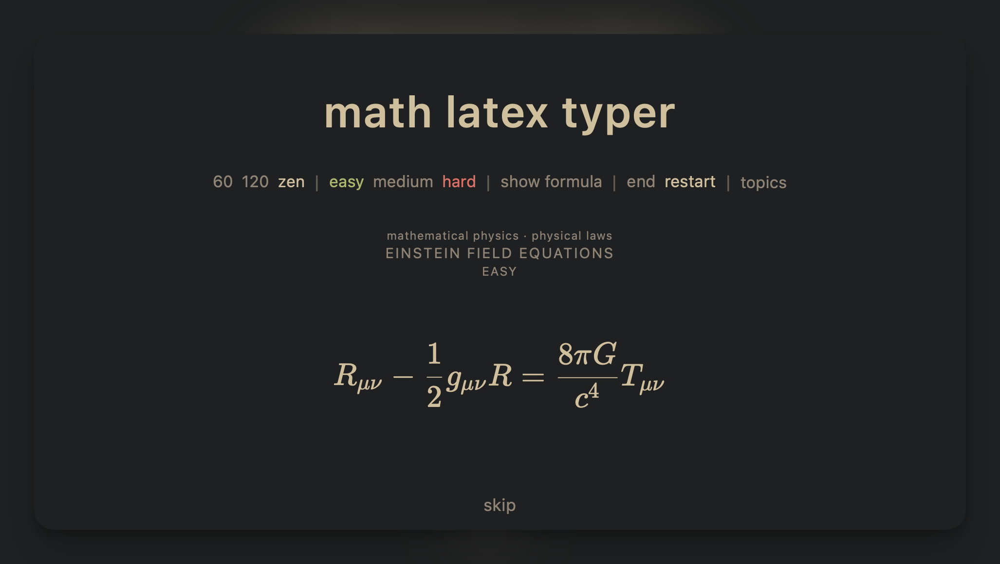

<div align="center">
  <h1>math latex typer</h1>
</div>

Minimal trainer for typing LaTeX math quickly.

**Heavily** inspired by [typelatex](https://github.com/JaidenRatti/type-latex) and therefore, as the geneology goes, by [texnique](https://github.com/akshayravikumar/TeXnique).
## What it does
- Shows a rendered target formula.
- You type LaTeX in the input that must produce the same render.
- It auto-advances when your input is correct.
- You can filter formulas by difficulty, topic and subtopic.
- Progress and best scores are saved locally in your browser.
## Other features
- When you’re learning, you can enable “show formula”, so you can just retype the answer and learn the symbols.
- After 5 minutes of inactivity in zen mode session automaticaly end to not spoil statistics. 
## Comparison
**TODO**
## FAQ
### About difficulty 
Difficulty is based on **typing complexity**, not conceptual math depth. It uses a deterministic complexity score from expression structure and symbol load. You can read about it more in ... **TODO** 
### About number of formulas in categories 
Any single formula can belong to multiple topics/subtopics. Counts are membership totals, not mutually exclusive buckets.

Moreover, classification was mostly automatic and, to be honest, should not be treated too seriously, only as a helpful hint. You can hover on the displayed topic of the current formula and see to which other ones it also belongs. 

Note that when you filter formulas by difficulty, the formulas shown in the topic selection are filtered as well – so don’t be surprised if there are fewer of them listed.
## Local storage and statistics
For history cap for sessions is set to 500, after that the very first session will be deleted to reclame space for the new one.

In "total" overview of statistics first 3 metrics i.e. accuracy, min/formula, chars/min are calculated withing a rolling window of 7 last runs, because while typing you improve your results and really old attempts can really ruin these metrics. On the other hand, second 3 metrics i.e. are calculated over the entire history, because they are there to show you big numbers, make you proud of efforts you put into your practice and inspire you to continue.
## Planned features
- Render-aware correctness check 
- load custom user formulas
    - export statistics (and formulas?)
- better formulas
    - better ontology and llm auto classification
    - parse more formulas from wikipedea, wikidata, proof wiki
- integrate auto-shortcuts/expansions 
- ?
    - symbols library as a separate page
    - Gamefication mode: add rarity to formulas and probability of them appearing (for the first time / after they appeared once) with some collors and little effects. Bestiary/collection.
## Run it yourself 
```bash
git clone https://github.com/levYatsishin/textyper.git
cd textyper 
npm install
npm run dev
```
Open `http://localhost:5173`.
## Project structure
- `src/lib/data/formulas.v1.json` – runtime formula source of truth
- `src/lib/data/expressions.ts` – JSON-backed dataset export
- `src/lib/data/expressionsLoader.ts` – JSON schema validation/loader
- `src/lib/services/` – matcher, persistence, complexity scoring
- `src/lib/stores/gameStore.ts` – game/session state
- `tools/complexity/` – scoring diagnostics/tooling
- `tools/formula_ingest/` – offline dataset ingestion pipeline

## Formula dataset workflow
- Runtime reads formulas from `src/lib/data/formulas.v1.json`.
- `expressionsLoader` validates every record (difficulty enums, score range, non-empty topics/subtopics, known topic IDs, unique IDs).
- Offline ingestion can export app-ready payloads in the same shape via `tools/formula_ingest/src/export_for_app.py`.
- After dataset updates, run `npm run check && npm run test:run` to validate schema and app compatibility.
## Contributing
Ideas and improvements are always welcome via issues, PRs or even direct messages.

## License
`math latex typer` is free software: you can redistribute it and/or modify it under the terms of the GNU Affero General Public License, either version 3 of the License, or (at your option) any later version. See the `LICENSE` file for details.

The following libraries and frameworks are used in this software:
- `katex`, which is MIT licensed.
- `html2canvas`, which is MIT licensed.
- `pixelmatch`, which is ISC licensed.
- `svelte`, which is MIT licensed.
- `vite`, which is MIT licensed.
- `typescript`, which is Apache-2.0 licensed.
- `vitest`, which is MIT licensed.
- `@testing-library/svelte`, which is MIT licensed.
- `jsdom`, which is MIT licensed.
